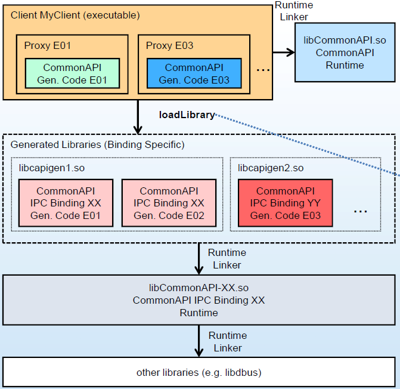
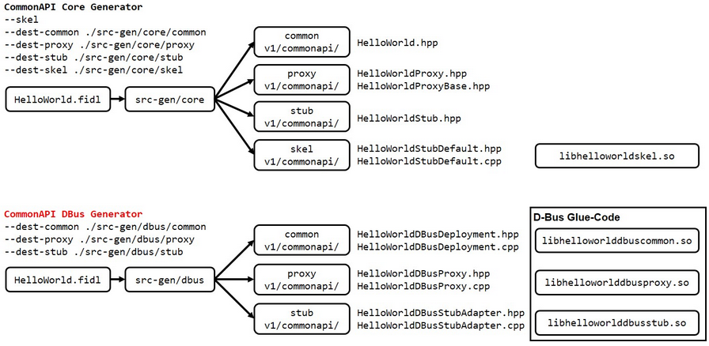
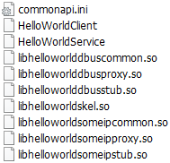

# CommonAPI C++ with Bindings

在CommonAPI c++的简单介绍示例中，我们创建了共享运行时库以及vsomeip和libdbus的共享库。
但是应用程序本身(HelloWorldClient和HelloWorldService)在一个可执行文件中不仅包含应用程序代码，而且还包含特定于绑定的生成代码。
但这并不是我们在有很多接口的大型项目中会做的事情，因为:

* 如果一个接口在目标上的多个服务中实现，则为该接口生成的代码也会多次存在。
* 它不是很灵活;D-Bus或SOME/IP的使用的决定是在CMake文件中做出的:如果我们决定从D-Bus更改到SOME/IP，我们需要编写另一个CMake文件并重新编译所有内容。

下面我们就来看看如何在这两方面都取得进步。首先，我们必须更改我们的CMake文件，以便为生成的代码构建库。
其次，我们必须改变CommonAPI c++配置，使其能够通过D-Bus或SOME/IP进行通信，这取决于这个配置。
在我们进一步讨论之前，先解释一下CommonAPI c++工作的基本原理。



如果我们创建的共享库(Linux中的so-files)实现了应用程序的某些功能，那么我们必须在构建系统中指定这个库(例如CMake中的link_directories)，并且动态运行时链接器会在应用程序启动时加载这个库。

CommonAPI c++是这样构造的，应用程序必须链接到CommonAPI运行库和生成的CommonAPI c++代码，但不能链接到任何绑定特定的代码。

如果特定于绑定的生成代码(胶水代码,请参见libcapigen1在图片中)不是应用程序的一部分，那么它将通过CommonAPI c++配置由`dlopen`加载。

CommonAPI c++配置文件中包含是否加载D-Bus胶码或SOME/IP胶码的信息;然后运行时链接器将加载绑定特定的运行时库和需要的进一步共享库(在我们的例子中是libdbus或vsomeip)。

这个过程对于大多数项目来说都足够灵活;它甚至允许它在一个应用程序中创建同一个接口的两个实例，一个实例可以通过D-Bus访问;另一个通过SOME/IP。

## 生成代码并创建一个适配的CMake文件

开始前, 确保已经完成 [CommonAPI C++ with D-Bus](./covesa_dbus.md), [CommonAPI C++ with SOME/IP](./covesa_someip.md)

下图显示了构建过程的输入和输出:



* 我们调用D-Bus代码生成器，以便它为公共代码、代理代码和存根代码创建不同的目录
* 我们对SOME/IP代码生成器做同样的操作(图中没有显示)
* 我们现在为通用代码、代理代码和存根代码以及SOME/IP和D-Bus创建了不同的库
* 我们还为框架代码创建了一个单独的库

将代理库、存根库和公共库划分开来是有意义的，因为客户端只需要代理代码，服务只需要存根代码，而公共代码是每个人都需要的。框架代码在一个单独的库中，因为应用程序可能不使用生成的框架代码，而是实现了存根，而没有继承默认实现。在一个库中不混淆D-Bus和SOME/IP胶水代码也是有意义的。

> 原则上，除框架代码外，CommonAPI核心生成器只生成c++头文件。但是有一个例外:如果你在你的Franca文件中使用了多态结构，在核心生成器的公共目录中也会有cpp-文件，这必须考虑。

如图所示，调用如下代码生成器获取不同的子目录:

```shell
cd ~/workspace/COVESA_prjs && mkdir -p bindings/fidl
cp ./someip/fidl/** ./bindings/
cp ./someip/src ./bindings/
cd bindings
.~/workspace/commonapi_core_generator/commonapi-core-generator-linux-x86_64 --skel --dest-common ./src-gen/core/common --dest-proxy ./src-gen/core/proxy --dest-stub ./src-gen/core/stub --dest-skel ./src-gen/core/skel ./fidl/HelloWorld.fidl

.~/commonapi_dbus_generator/commonapi-dbus-generator-linux-x86_64 --dest-common ./src-gen/dbus/common --dest-proxy ./src-gen/dbus/proxy --dest-stub ./src-gen/dbus/stub ./fidl/HelloWorld.fidl

.~/commonapi_someip_generator/commonapi-someip-generator-linux-x86_64 --dest-common ./src-gen/someip/common --dest-proxy ./src-gen/someip/proxy --dest-stub ./src-gen/someip/stub ./fidl/HelloWorld.fdepl
```

因此，在src-gen目录下可以找到core, dbus和someip子文件夹。
现在，我们创建一个新的CMakeFile.txt，它帮助我们构建所有必要的库和构建HelloWorld应用程序。

```cmake
cmake_minimum_required(VERSION 2.8)
project(COVESA_BINDINGS)
set(CMAKE_CXX_FLAGS "${CMAKE_CXX_FLAGS} -pthread -std=c++0x -Wl,--no-as-needed")
set(CommonAPI_Version "3.2.0")
set(vsomeip_Version "3.1.20")

set(RUNTIME_PATH "/home/xxx/workspace")
# set(COMMONAPI_INCLUDE_DIRS "${RUNTIME_PATH}/capicxx-core-runtime/include")
# set(COMMONAPI_DBUS_INCLUDE_DIRS "${RUNTIME_PATH}/capicxx-dbus-runtime/include")
# set(COMMONAPI_SOMEIP_INCLUDE_DIRS "${RUNTIME_PATH}/capicxx-someip-runtime/include")
# set(VSOMEIP_INCLUDE_DIRS "${RUNTIME_PATH}/vsomeip/interface")

set(DBus_INCLUDE_DIRS "${RUNTIME_PATH}/dbus-1.10.10")
set(PROJ_ROOT_FOLDER "${PROJECT_SOURCE_DIR}")


MESSAGE(PROJECT_BINARY_DIR "=${PROJECT_BINARY_DIR}")
MESSAGE(PROJECT_SOURCE_DIR "=${PROJECT_SOURCE_DIR}")

include(FindPkgConfig)
find_package(CommonAPI ${CommonAPI_Version} REQUIRED CONFIG NO_SYSTEM_ENVIRONMENT_PATH NO_CMAKE_SYSTEM_PATH)
find_package(CommonAPI-DBus ${CommonAPI_Version} REQUIRED CONFIG NO_SYSTEM_ENVIRONMENT_PATH NO_CMAKE_SYSTEM_PATH)
find_package(CommonAPI-SomeIP ${CommonAPI_Version} REQUIRED)
find_package(vsomeip3 ${vsomeip_Version} REQUIRED)
# pkg_check_modules(DBus REQUIRED dbus-1>=1.10)

include_directories(
     src-gen/core/common
     src-gen/core/proxy
     src-gen/core/stub
     src-gen/core/skel
     src-gen/dbus/common
     src-gen/dbus/proxy
     src-gen/dbus/stub
     src-gen/someip/common
     src-gen/someip/proxy
     src-gen/someip/stub
     ${COMMONAPI_INCLUDE_DIRS}
     ${COMMONAPI_DBUS_INCLUDE_DIRS}
     ${COMMONAPI_SOMEIP_INCLUDE_DIRS}
     ${DBus_INCLUDE_DIRS}
     ${VSOMEIP3_INCLUDE_DIRS}
)

link_directories(
    ${PROJ_ROOT_FOLDER}/build
    ${DBus_INCLUDE_DIRS}/dbus/.libs
)

FILE(GLOB_RECURSE HELLOWORLD_SKEL_LIB_SRCS src-gen/core/skel/*)
add_library(helloworldskel SHARED ${HELLOWORLD_SKEL_LIB_SRCS})
set_target_properties(helloworldskel PROPERTIES LINKER_LANGUAGE CXX)
target_link_libraries(helloworldskel)

FILE(GLOB_RECURSE HELLOWORLD_DBUS_COMMON_LIB_SRCS src-gen/dbus/common/*.cpp)
add_library(helloworlddbuscommon SHARED ${HELLOWORLD_DBUS_COMMON_LIB_SRCS})
target_link_libraries(helloworlddbuscommon CommonAPI-DBus dbus-1)

FILE(GLOB_RECURSE HELLOWORLD_DBUS_PROXY_LIB_SRCS src-gen/dbus/proxy/*.cpp)
add_library(helloworlddbusproxy SHARED ${HELLOWORLD_DBUS_PROXY_LIB_SRCS})
target_link_libraries(helloworlddbusproxy CommonAPI-DBus dbus-1)

FILE(GLOB_RECURSE HELLOWORLD_DBUS_STUB_LIB_SRCS src-gen/dbus/stub/*.cpp)
add_library(helloworlddbusstub SHARED ${HELLOWORLD_DBUS_STUB_LIB_SRCS})
target_link_libraries(helloworlddbusstub CommonAPI-DBus dbus-1)

FILE(GLOB_RECURSE HELLOWORLD_SOMEIP_COMMON_LIB_SRCS src-gen/someip/common/*.cpp)
add_library(helloworldsomeipcommon SHARED ${HELLOWORLD_SOMEIP_COMMON_LIB_SRCS})
target_link_libraries(helloworldsomeipcommon CommonAPI-SomeIP vsomeip3)

FILE(GLOB_RECURSE HELLOWORLD_SOMEIP_PROXY_LIB_SRCS src-gen/someip/proxy/*.cpp)
add_library(helloworldsomeipproxy SHARED ${HELLOWORLD_SOMEIP_PROXY_LIB_SRCS})
target_link_libraries(helloworldsomeipproxy CommonAPI-SomeIP vsomeip3)

FILE(GLOB_RECURSE HELLOWORLD_SOMEIP_STUB_LIB_SRCS src-gen/someip/stub/*.cpp)
add_library(helloworldsomeipstub SHARED ${HELLOWORLD_SOMEIP_STUB_LIB_SRCS})
target_link_libraries(helloworldsomeipstub CommonAPI-SomeIP vsomeip3)

add_executable(HelloWorldClient src/HelloWorldClient.cpp)
target_link_libraries(HelloWorldClient CommonAPI)

add_executable(HelloWorldService src/HelloWorldService.cpp src/HelloWorldStubImpl.cpp)
target_link_libraries(HelloWorldService CommonAPI helloworldskel)
```

创建配置文件 `commonapi.ini`

```
[proxy]
local:commonapi.HelloWorld:v1_0:testDBus=libhelloworlddbusproxy.so
local:commonapi.HelloWorld:v1_0:testSomeIP=libhelloworldsomeipproxy.so

[stub]
local:commonapi.HelloWorld:v1_0:testDBus=libhelloworlddbusstub.so
local:commonapi.HelloWorld:v1_0:testSomeIP=libhelloworldsomeipstub.so 
```

在`build`目录编译后得到如下结果:
```shell
cd ~/workspace/COVESA_prjs/bindings && mkdir build && cd build
cmake ..
make
```


* commonapi.ini文件可以是全局的(在/etc中)，也可以是本地的(在与应用程序相同的目录中，最高优先级)，或者文件的位置可以由环境变量(COMMONAPI_CONFIG)确定。
* 胶水代码的配置不仅可以用来更改绑定;还有其他的可能性，例如改变接口版本。
* 请注意，我们的HelloWorld代码太简单了;如果没有找到粘合代码，那么指向代理对象的共享指针将为NULL。在这个例子中，while (!(myProxyDBus->isAvailable()){…}导致分割错误。因此，总是检查是否可以创建代理。
* 在同一个应用程序中创建两个HelloWorld实例，并通过D-Bus与一个实例通信，通过SOME/IP与另一个实例通信是没有问题的。

## 修改client和service程序

[HelloWorldClient.cpp](../code/COVESA_prjs/bindings/src/HelloWorldClient.cpp)

[HelloWorldService.cpp](../code/COVESA_prjs/bindings/src/HelloWorldService.cpp)

然后再编写service的实现

[HelloWorldStubImpl.hpp](../code/COVESA_prjs/bindings/src/HelloWorldStubImpl.hpp)

[HelloWorldStubImpl.cpp](../code/COVESA_prjs/bindings/src/HelloWorldStubImpl.cpp)

## 配置运行

在`build`目录下创建配置文件 `commonapi.ini`

```shell
./HelloWorldService &
./HelloWorldClient
```

详见 [bindings sample](../code/COVESA_prjs/bindings/)