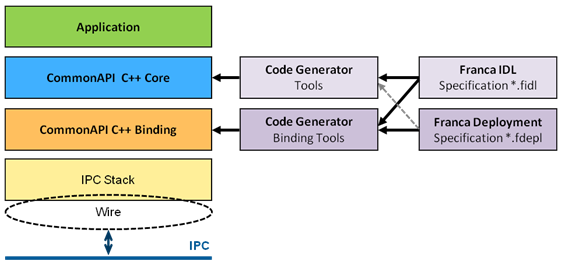
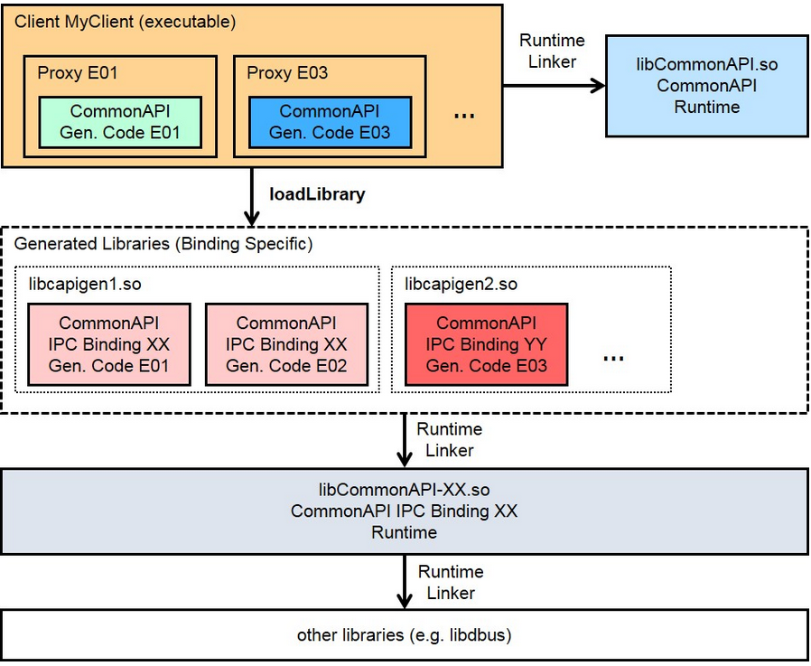

# CommonAPI C++

CommonAPI C++是用于开发分布式应用程序的标准C++ API规范，该分布式应用程序通过中间件进行进程间通信。

## CommonAPI C++的目的

CommonAPI C++依靠FrancaIDL来描述静态接口，根据通信协议部署参数，一起组建完整的实例依赖关系模型。目的是封装通信协议和相邻的中间件，使应用程序的C++接口独立于底层IPC堆栈。

也就是IPC Common API允许针对开发的应用程序（即使用C++的客户端和服务器）可以与不同的IPC后端链接（someip，或D-Bus），而无需更改应用程序代码。因此，为使用特定IPC X（例如someip）的系统开发的组件可以轻松地部署到另一个使用IPC Y（例如D-Bus）的系统，只需要交换IPC Common API后端（someip或D-Bus），而无需重新编译应用程序代码。

实际的接口定义将使用Franca IDL创建（*.fild文件）。

而各项部署根据部署文件定义（*.fdepl文件）。

> [Franca ](https://github.com/franca/franca)  is a powerful framework for definition and transformation of software interfaces. It is used for integrating software components from different suppliers, which are built based on various runtime frameworks, platforms and IPC mechanisms.

## CommonAPI的组成原理

* CommonAPI C++分为独立于中间件的部分（CommonAPI Core，仅仅指CommonAPI
接口）和特定于中间件的部分（CommonAPI Binding，用于选择使用的IPC协议的代码）
* CommonAPI将接口描述语言Franca IDL用于接口规范（逻辑接口规范，*.fidl文件）。Franca IDL的代码生成的是CommonAPI的组合部分。主要指逻辑接口的变量部分，那是接口的一部分，它取决于Franca IDL文件中的规范（数据类型，数组，枚举和就基础知识，包括属性，方法，回调，错误处理，广播）。
* CommonAPI C++ binding的代码生成器需要特定于中间件的参数（部署参数，例如String数据类型的编码/解码格式）。这些参数在Franca部署文件（*.fdepl）中定义。主要独立于接口规范。

CommonAPI的用户API分为两部分:

* 基于FrancaIDL的生成部分，其中包含与FrancaIDL文件的类型，属性和方法有关的API函数。也就是根据*.fidl文件生成的API函数
* “公共”部分（Runtime API），其中包含用于加载运行时环境，创建proxy等的API函数。也就是根据*.fidl文件与*.fdepl文件生成的代码中所包含的头文件所链接的库（CommonAPI lib files + CommonAPI someip/d-bus lib files）

上图详细地显示了CommonAPI C++的元素如何组合在一起.

* 用户API的绝大多数是CommonAPI的生成部分
* CommonAPI Core和IPC堆栈之间没有直接关系
* CommonAPI binding的生成代码具有CommonAPI其他部分的所有接口

## CommonAPI基本的工作流程

应用程序开发人员的工作流程如下：

* 创建具有方法和属性的接口规范的FrancaIDL文件。
* 通过启动CommonAPI代码生成器为客户端和服务端生成代码。
* 通过实现所生成框架中的方法来实现服务；或设置为默认实现。
* 在应用程序中通过创建proxy并使用proxy调用这些方法来实现客户端。

## 构建CommonAPI项目库

CommonAPI可执行文件通常由6部分组成：

1. 应用程序代码本身是由开发人员手动编写的
2. 生成的CommonAPI(绑定独立)代码。根据*.fidl文件生成的代码
   1. 在客户端，这段代码包含proxy函数，由应用程序调用
   2. 在服务中，它包含生成的函数，这些函数必须由开发人员手动实现(也可以生成默认实现)
3. CommonAPI运行时库
4. 生成的绑定特定代码(所谓的粘合代码)。根据*.fdepl文件生成的代码
5. 绑定的运行时库
6. 使用的中间件的通用库(例如libdbus/vsomeip)

## 参考

[CommonAPI 使用说明文档](https://blog.csdn.net/C_Silence_K/article/details/104673833)

[13th GENIVI AMM - October 2015](https://wiki.covesa.global/display/WIK4/13th+GENIVI+AMM+-+October+2015)

[CommonAPI C++ Update 21-Oct-15](../doc/reference/CommonAPICppAMMSeoul.pdf)

[CommonAPI C++ Update 28-April-2016](../doc/reference/GENIVI%20AMM%20Paris%20CommonAPI%20Cpp.pdf)

[CommonAPI-Examples](https://github.com/COVESA/capicxx-core-tools/tree/master/CommonAPI-Examples)