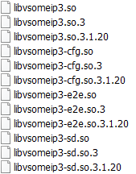

# CommonAPI C++ with SOME/IP

## 前提准备

1.  CommonAPI 3.2.0
2.  Ubuntu 16
3.  Installed git and (CMake >=2.8)
4.  Java 8 runtime
5.  CommonAPI Runtime库 - 参见 [CommonAPI C++ with D-Bus](covesa_dbus.md)

## 构建CommonAPI SOME/IP Runtime库

```shell
cd ~/workspace
git clone --b 3.2.0 https://github.com/GENIVI/capicxx-someip-runtime.git
```

`CommonAPI SOME/IP Runtime`库依赖`vsomeip`库.

```shell
cd ~/workspace
git clone --b 3.1.20.3 https://github.com/COVESA/vsomeip.git
cd ~/workspace/vsomeip
mkdir build
cd build
cmake -DENABLE_SIGNAL_HANDLING=1 -DDIAGNOSIS_ADDRESS=0x10 ..
make
```

最终在`build`目录下构建出`libsomeip3`打头的库.



开始构建`CommonAPI SOME/IP Runtime`库

```shell
cd ~/workspace/capicxx-someip-runtime && mkdir build && cd build
cmake -DUSE_INSTALLED_COMMONAPI=OFF ..
make
```

## 定义Franca接口文件和生成代码

```shell
cd ~/workspace && mkdir -p COVESA_prjs/someip/fidl
# 直接拷贝 CommonAPI C++ with D-Bus中定义的HelloWorld.fidl
cp ./COVESA_prjs/dbus/fidl/HelloWorld.fidl ./COVESA_prjs/someip/fidl
```

`SOME/IP`规范需要额外的定义关于service和method. `FrancaIDL` 提供 `.fdepl` (deployment specification file) 部署定义文件.

```shell
cd ./COVESA_prjs/someip/fidl
vi HelloWorld.fdepl
```

```fdepl
import "platform:/plugin/org.genivi.commonapi.someip/deployment/CommonAPI-SOMEIP_deployment_spec.fdepl"
import "HelloWorld.fidl"

define org.genivi.commonapi.someip.deployment for interface commonapi.HelloWorld {
	SomeIpServiceID = 4660

	method sayHello {
		SomeIpMethodID = 123
	}
}

define org.genivi.commonapi.someip.deployment for provider as MyService {
	instance commonapi.HelloWorld {
		InstanceId = "test"
		SomeIpInstanceID = 22136
	}
}
```

下载 [commonapi_core_generator](https://github.com/COVESA/capicxx-core-tools/releases/download/3.2.0.1/commonapi_core_generator.zip) & [commonapi_someip_generator](https://github.com/COVESA/capicxx-someip-tools/releases/download/3.2.0.1/commonapi_someip_generator.zip) 后解压至 `~/workspace`

```shell
cd ~/workspace/COVESA_prjs/someip
.~/workspace/commonapi_core_generator/commonapi-core-generator-windows-x86_64 -sk ./fidl/HelloWorld.fidl

.~/workspace/commonapi_someip_generator/commonapi-someip-generator-linux-x86_64 ./fidl/HelloWorld.fdepl
```

一切顺利后会在  `fidl`的同级目录下生成 `src-gen`目录及目录里的文件

## 编写client和service程序

[HelloWorldClient.cpp](../code/COVESA_prjs/someip/src/HelloWorldClient.cpp)

[HelloWorldService.cpp](../code/COVESA_prjs/someip/src/HelloWorldService.cpp)

然后再编写service的实现

[HelloWorldStubImpl.hpp](../code/COVESA_prjs/someip/src/HelloWorldStubImpl.hpp)

[HelloWorldStubImpl.cpp](../code/COVESA_prjs/someip/src/HelloWorldStubImpl.cpp)

## 编译运行

```cmake
cmake_minimum_required(VERSION 2.8)

set(CMAKE_CXX_FLAGS "${CMAKE_CXX_FLAGS} -pthread -std=c++0x")
set(RUNTIME_PATH "/home/xxx/workspace")
include_directories(
    src-gen
    ${RUNTIME_PATH}/capicxx-core-runtime/include
    ${RUNTIME_PATH}/capicxx-someip-runtime/include
    ${RUNTIME_PATH}/vsomeip/interface
)
link_directories(
    ${RUNTIME_PATH}/capicxx-core-runtime/build
    ${RUNTIME_PATH}/capicxx-someip-runtime/build
    ${RUNTIME_PATH}/vsomeip/build
)
add_executable(HelloWorldClient
	src/HelloWorldClient.cpp
	src-gen/v1/commonapi/HelloWorldSomeIPProxy.cpp
	src-gen/v1/commonapi/HelloWorldSomeIPDeployment
)
target_link_libraries(HelloWorldClient CommonAPI CommonAPI-SomeIP vsomeip3)
add_executable(HelloWorldService
	src/HelloWorldService.cpp
	src/HelloWorldStubImpl.cpp
	src-gen/v1/commonapi/HelloWorldSomeIPStubAdapter.cpp
	src-gen/v1/commonapi/HelloWorldStubDefault
	src-gen/v1/commonapi/HelloWorldSomeIPDeployment
)
target_link_libraries(HelloWorldService CommonAPI CommonAPI-SomeIP vsomeip3)
```

```shell
cd ~/workspace/COVESA_prjs/someip && mkdir build && cd build
cmake ..
make
./HelloWorldService &
./HelloWorldClient
```

详见 [someip sample](../code/COVESA_prjs/someip/)