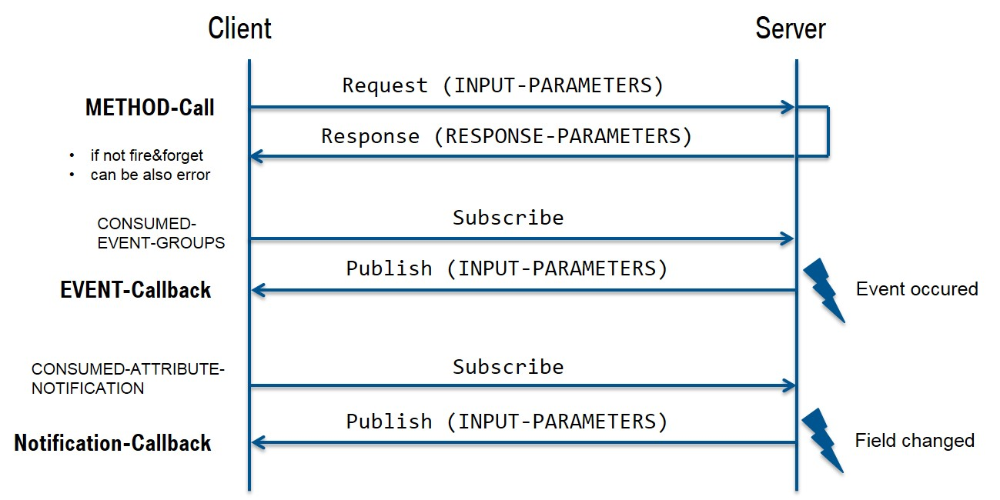

# SOME/IP 概览

Scalable service-Oriented MiddlewarE over IP (SOME/IP)

## 简介

SOME/IP 是一个汽车的中间件解决方案，可用于控制消息。从一开始，它的设计就是为了完美地适应不同尺寸和不同操作系统的设备。
这包括小型设备，如相机、AUTOSAR设备，以及头部单元或远程信息处理设备。同时还确保了SOME/IP支持信息娱乐域以及车内其他域的功能，
从而使SOME/IP可以用于多数替换场景以及更传统的CAN场景。

## 规范

我们从SOME/IP规范的三个主要部分开始:
* On-wire format
* Protocol
* Service Discovery

### SOME/IP On-Wire Format

原则上，SOME/IP通信由通过IP在设备或订阅者之间发送的消息组成。

SOME/IP消息有两部分:报头和有效负载。在图片中，你可以看到头文件主要由标识符组成:
* Message ID: 消息ID应该是用于识别的32位标识符 对应用程序方法的RPC调用或者确定一个事件
  * Service ID: 每个服务的唯一标识符
  * Method ID: 0-32767表示方法，32768-65535表示事件
    * 
    * 
* Length: 有效负载的字节长度,长度字段应该包含从请求ID/客户端ID到SOME/IP消息结束的字节长度。
* Request ID: 请求ID允许提供者和订阅者区分同一方法、事件、getter或setter的多个并行使用。
   * Client ID: ECU内部区分客户端的唯一标识符;在整个车辆中必须是独一无二的吗
   * Session ID: 会话处理的标识符;每次调用都要递增
   * AUTOSAR中结构 
* Protocol Version: 协议版本标识了所使用的SOME/IP报头格式
* Interface Version: 业务接口主版本
* Message Type: 用于区分不同的类型的消息
   * REQUEST(0x00)           请求等待响应的请求(即使void)   
   * REQUEST_NO_RETURN(0x01) 一个fire&forget请求
   * NOTIFICATION(0x02)      通知/事件回调请求期待没有响应
   * RESPONSE(0x80)          响应消息
   * ERROR(0x81)             响应中包含错误
* Return Code: 返回码表示请求是否被成功处理
   * E_OK (0x00) No error occurred 
   * E_NOT_OK (0x01) An unspecified error occurred
   * E_WRONG_INTERFACE_VERSION (0x08) Interface version mismatch
   * E_MALFORMED_MESSAGE (0x09) Deserialization error, so that payload cannot be deseria-lized
   * E_WRONG_MESSAGE_TYPE (0x0A) An unexpected message type was received (e.g. RE-QUEST_NO_RETURN for a method defined as RE-QUEST)

有效负载包含序列化的数据。图中显示了简单情况下的序列化，即传输的数据结构是只有基本数据类型的嵌套结构。在这种情况下，这很简单:struct元素只是扁平化的，这意味着它们只是一个接一个地写入有效负载中。

### SOME/IP Protocol

基本的通信模式是发布/订阅和请求/响应, 传输协议基于UDP和TCP.

底层传输协议可以是UDP或TCP。在UDP的情况下，SOME/IP消息不是分片的;可以是一个UDP包中有多个消息，但一条消息不能超过一个UDP包的长度(最多1400字节)。较大的消息必须通过TCP传输。在这种情况下，使用了TCP的鲁棒性特征。如果TCP流发生同步错误，SOME/IP规范允许所谓的魔法cookie，以便再次找到下一个消息的开始。

请注意，必须实例化服务接口，因为同一个接口可能有多个实例，所以必须为定义的实例提供一个额外的标识符(实例ID)。但是实例ID不是SOME/IP消息头的一部分。该实例通过传输协议的端口号识别;这意味着在同一个端口上提供同一个接口的多个实例是不可能的。

除了用于远程过程调用的标准REQUEST/RESPONSE机制外，还有用于事件的PUBLISH/SUBSCRIBE模式。注意，SOME/IP协议中的事件总是分组在一个事件组中;因此，只能订阅事件组，而不能订阅事件本身。订阅本身是通过SOME/IP服务发现完成的。

### SOME/IP Service discovery

SOME/IP服务发现用于定位服务实例，并检测服务实例是否正在运行，以及实现发布/订阅处理。这主要是通过所谓的信息提供声明实现的;这意味着每个设备广播(多播)包含该设备提供的所有服务的消息。SOME/IP SD消息是通过UDP发送的。如果客户端应用程序需要服务，但目前还没有提供，那么还可以发送“查找消息”。其他一些/IP SD消息可以用于发布或订阅事件组。

下图显示了SOME/IP SD消息的一般结构。

SOME/IP-SD示例

