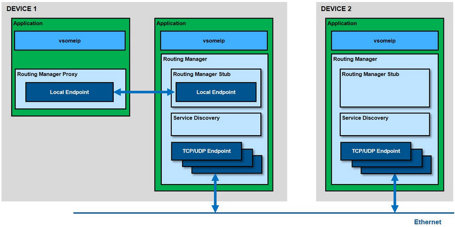

# vsomeip

An implementation of Scalable service-Oriented MiddlewarE over IP.


## vsomeip Short Overview

SOME/IP的GENIVI实现的vsomeip基本结构



如图所示，vsomeip不仅包括设备之间的SOME/IP通信(外部通信)，还包括内部进程间的通信。两台设备通过所谓的通信端点进行通信，通信端点决定了所使用的传输协议(TCP或UDP)及其参数作为端口号或其他参数。这些参数都是配置参数，可以在vsomeip配置文件(json文件，参见vsomeip用户指南)中设置。内部通信是通过使用Boost的Asio库unix域套接字实现的本地端点来完成的。由于这种内部通信不是通过中心组件(例如D-Bus守护进程)路由的，所以它非常快.

中央vsomeip路由管理器只在必须发送到外部设备的情况下接收消息，并分发来自外部的消息。每个设备只有一个路由管理器;如果没有配置任何内容，第一个运行的vsomeip应用程序也会启动路由管理器。

## Preparation / Prerequisites

Build Instructions for Linux(Ubuntu)

Dependencies:
* A C++11 enabled compiler like gcc >= 4.8 is needed.
* vsomeip uses CMake as buildsystem.
* vsomeip uses Boost >= 1.55

Download [Boost 1.78.0](https://boostorg.jfrog.io/artifactory/main/release/1.78.0/source/boost_1_78_0.tar.gz)

or clone source code as below:

```shell
git clone --b boost-1.78.0 https://github.com/boostorg/boost.git
```

```shell
tar -xvf boost_1_78_0.tar.gz
cd boost_1_78_0
./bootstrap.sh --prefix=/usr/local
./b2 install
```

To build the documentation asciidoc, source-highlight, doxygen and graphviz is needed

```shell
sudo apt-get install asciidoc source-highlight doxygen graphviz
```

Donwload vsomeip code

```shell
git clone --b 3.1.20.3 https://github.com/COVESA/vsomeip.git
```

## Compilation

```shell
cd ~/workspace/vsomeip
mkdir build
cd build
cmake -DENABLE_SIGNAL_HANDLING=1 -DDIAGNOSIS_ADDRESS=0x10 ..
make
```

> ENABLE_SIGNAL_HANDLING=1 ensures that you can kill your vsomeip application without any problems

## First Application

`service_example.cpp`

```c++
#include <vsomeip/vsomeip.hpp>

std::shared_ptr< vsomeip::application > app;

int main() {

    app = vsomeip::runtime::get()->create_application("World");
    app->init();
    app->start();
}
```

创建vsomeip应用程序后，必须首先调用init方法，并执行以下步骤初始化它
* 加载配置
* 确定路由配置和路由的初始化
* 安装信号处理程序

为了启动消息处理，必须在init之后调用start方法。接收到的消息通过套接字进行处理，并使用已注册的回调函数将它们传递给用户应用程序。

`CMakeLists.txt`

```cmake
cmake_minimum_required (VERSION 2.8)

set (CMAKE_CXX_FLAGS "-g -std=c++0x")

find_package(vsomeip3 3.1.20 REQUIRED)
find_package(Boost 1.78.0 COMPONENTS system thread log REQUIRED )

include_directories (
    ${Boost_INCLUDE_DIR}
    ${VSOMEIP_INCLUDE_DIRS}
)

add_executable(service-example ../src/service_example.cpp)
target_link_libraries(service-example vsomeip3 ${Boost_LIBRARIES})
```

## Availability

`service_example.cpp` with offer

```c++
#include <vsomeip/vsomeip.hpp>

#define SAMPLE_SERVICE_ID 0x1234
#define SAMPLE_INSTANCE_ID 0x5678

std::shared_ptr< vsomeip::application > app;

int main() {

    app = vsomeip::runtime::get()->create_application("World");
    app->init();
    app->offer_service(SAMPLE_SERVICE_ID, SAMPLE_INSTANCE_ID);
    app->start();
}
```

`client_example.cpp`

```c++
#include <iomanip>
#include <iostream>

#include <vsomeip/vsomeip.hpp>

#define SAMPLE_SERVICE_ID 0x1234
#define SAMPLE_INSTANCE_ID 0x5678

std::shared_ptr< vsomeip::application > app;

void on_availability(vsomeip::service_t _service, vsomeip::instance_t _instance, bool _is_available);

int main() {

    app = vsomeip::runtime::get()->create_application("Hello");
    app->init();
    app->register_availability_handler(SAMPLE_SERVICE_ID, SAMPLE_INSTANCE_ID, on_availability);
    app->request_service(SAMPLE_SERVICE_ID, SAMPLE_INSTANCE_ID);
    app->start();
}
```

## Request / Response

`service_example.cpp` with offer and message handler

```c++
#include <iomanip>
#include <iostream>
#include <sstream>

#include <vsomeip/vsomeip.hpp>

#define SAMPLE_SERVICE_ID 0x1234
#define SAMPLE_INSTANCE_ID 0x5678
#define SAMPLE_METHOD_ID 0x0421

std::shared_ptr<vsomeip::application> app;

void on_message(const std::shared_ptr<vsomeip::message> &_request) ;

int main() {

   app = vsomeip::runtime::get()->create_application("World");
   app->init();
   app->register_message_handler(SAMPLE_SERVICE_ID, SAMPLE_INSTANCE_ID, SAMPLE_METHOD_ID, on_message);
   app->offer_service(SAMPLE_SERVICE_ID, SAMPLE_INSTANCE_ID);
   app->start();
}
```

`client_example.cpp` with message handler and send function

```c++
#include <iomanip>
#include <iostream>
#include <sstream>

#include <condition_variable>
#include <thread>

#include <vsomeip/vsomeip.hpp>

#define SAMPLE_SERVICE_ID 0x1234
#define SAMPLE_INSTANCE_ID 0x5678
#define SAMPLE_METHOD_ID 0x0421

std::shared_ptr< vsomeip::application > app;
std::mutex mutex;
std::condition_variable condition;

void run() {
  
  std::shared_ptr< vsomeip::message > request;
  request = vsomeip::runtime::get()->create_request();
  request->set_service(SAMPLE_SERVICE_ID);
  request->set_instance(SAMPLE_INSTANCE_ID);
  request->set_method(SAMPLE_METHOD_ID);

  std::shared_ptr< vsomeip::payload > its_payload = vsomeip::runtime::get()->create_payload();
  std::vector< vsomeip::byte_t > its_payload_data;
  // set payload data
  its_payload->set_data(its_payload_data);
  request->set_payload(its_payload);
  app->send(request, true);
}

void on_message(const std::shared_ptr<vsomeip::message> &_response) ;

void on_availability(vsomeip::service_t _service, vsomeip::instance_t _instance, bool _is_available);

int main() {

    app = vsomeip::runtime::get()->create_application("Hello");
    app->init();
    app->register_availability_handler(SAMPLE_SERVICE_ID, SAMPLE_INSTANCE_ID, on_availability);
    app->request_service(SAMPLE_SERVICE_ID, SAMPLE_INSTANCE_ID);
    app->register_message_handler(SAMPLE_SERVICE_ID, SAMPLE_INSTANCE_ID, SAMPLE_METHOD_ID, on_message);
    std::thread sender(run);
    app->start();
}
```

## Subscribe / Notify

`service_example.cpp` main method

```c++
const vsomeip::byte_t its_data[] = { 0x10 };
payload = vsomeip::runtime::get()->create_payload();
payload->set_data(its_data, sizeof(its_data));

std::set<vsomeip::eventgroup_t> its_groups;
its_groups.insert(SAMPLE_EVENTGROUP_ID);
app->offer_event(SAMPLE_SERVICE_ID, SAMPLE_INSTANCE_ID, SAMPLE_EVENT_ID, its_groups, true);
app->notify(SAMPLE_SERVICE_ID, SAMPLE_INSTANCE_ID, SAMPLE_EVENT_ID, payload);
```

`client_example.cpp`

```c++
// ...

void run() {
  std::set<vsomeip::eventgroup_t> its_groups;
  its_groups.insert(SAMPLE_EVENTGROUP_ID);
  app->request_event(SAMPLE_SERVICE_ID, SAMPLE_INSTANCE_ID, SAMPLE_EVENT_ID, its_groups, true);
  app->subscribe(SAMPLE_SERVICE_ID, SAMPLE_INSTANCE_ID, SAMPLE_EVENTGROUP_ID);
}

void on_message(const std::shared_ptr<vsomeip::message> &_response);

// ...

int main() {

    app = vsomeip::runtime::get()->create_application("Hello");
    app->init();
    app->register_availability_handler(SAMPLE_SERVICE_ID, SAMPLE_INSTANCE_ID, on_availability);
    app->request_service(SAMPLE_SERVICE_ID, SAMPLE_INSTANCE_ID);

    app->register_message_handler(vsomeip::ANY_SERVICE, vsomeip::ANY_INSTANCE, vsomeip::ANY_METHOD, on_message);

    std::thread sender(run);
    app->start();
}
```


详见 [vsomeip sample](../code/vsomip_prjs)

## Reference Links

[vsomeip in 10 minutes](https://github.com/COVESA/vsomeip/wiki/vsomeip-in-10-minutes)

[vsomeip github](https://github.com/COVESA/vsomeip)

[Boost](https://www.boost.org/)

[Boost github](https://github.com/boostorg/boost)